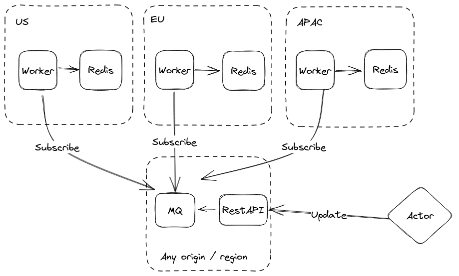

# Geo replicated Redis

## Motivation

Geo replication of different databases and storages (ex. Redis) is not simple question and cannot be solved by built-in
replication mechanism (ex. Redis cluster). This project is an attempt (one of the solutions) to solve such problem by
using existing software.

Use cases of geo replicated Redis:

* Geo replicated cache for geo replicated API
* Shared and non-persistent storage for geo replicated API (ex. storing aggregation of analytics data)
* CDN

Main reasons why built-in solution cannot solve geo replication problem:

* Constant network topology changes
* Packet loss issues (Network congestion, network hardware problems, overtaxed devices)

To maintain stable geo replication another protocol of communication between instances should be chosen which complies
with following requirements:

* Commonly used protocol, based on TCP connection
* Designed to handle high load
* Support multiple sender actors, receiver actors
* Retry mechanism if request / message wasn't successful.

## Solution

To implement geo replication of Redis as example following components will be used:

* Message Queue as communication transport
* RestAPI server to receive updates and push them to Message Queue
* Workers to read events from Message Queue and push them to Redis

Message queue is chosen as communication transport because:

* Complies with requirements
* Many solutions are exist as message queue (AMQP, Google PubSub, Amazon SQS and other)

Following schema represents architecture of geo replication in different regions.

Each region contains Redis (which will be used by another actor to read cache) and worker, which will be subscribed to
Message Queue topics and update state of region's Redis according to event payload.

Message Queue instance should be located in region near actor / application which is responsible for updating state of
Redis (ex. Application API server, application worker). RestAPI server is responsible to deliver new events to
Message Queue and return metadata of another components.